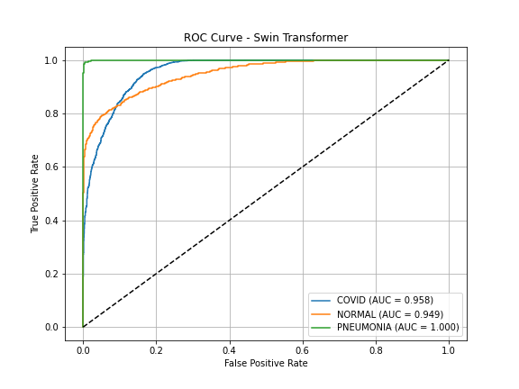
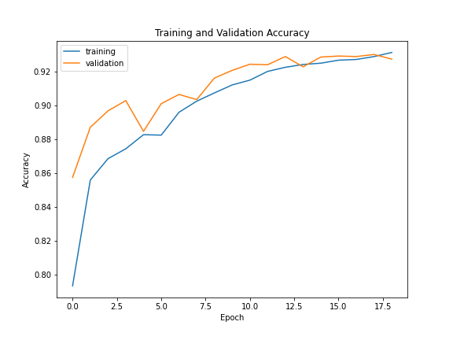
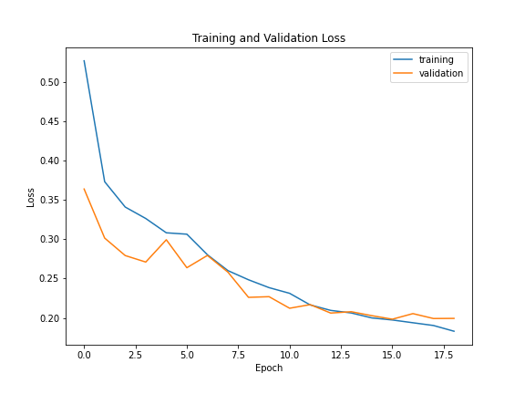
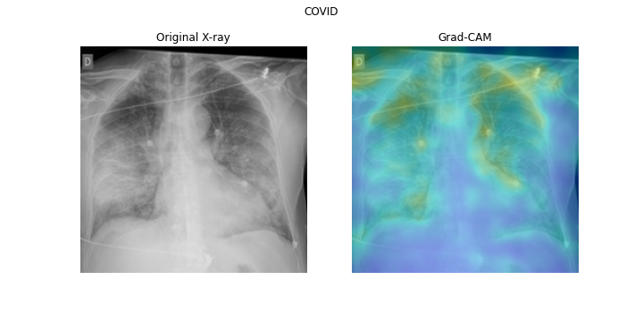
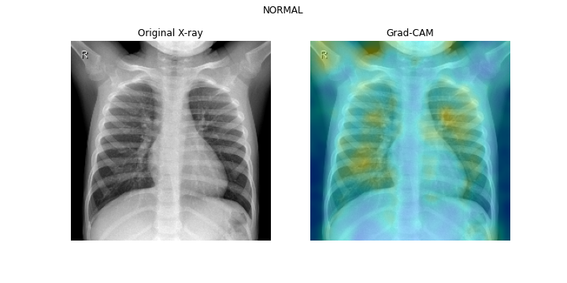
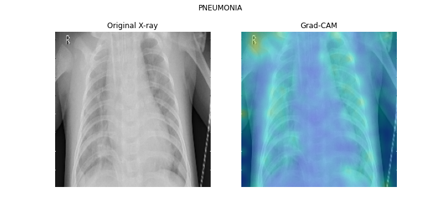

# 🧠 Multi-Class Radiological Diagnosis Using Swin Transformer

Deep learning project using **Swin Transformer** for multi-class classification of chest X-ray images into:

* COVID-19
* Normal
* Pneumonia

Achieves ~**93% accuracy** with strong evaluation metrics and interpretability using **Grad-CAM**.

---

## 🚀 Overview

This project leverages **Vision Transformers (Swin Transformer)** for medical image classification. Unlike CNNs, transformers capture global dependencies in images, making them highly effective for radiological diagnosis.

The model is trained on chest X-ray data and evaluated using multiple metrics, including ROC curves, confusion matrix, and Grad-CAM visualizations.

---

## 📊 Results

* **Test Accuracy:** ~93%
* **Strong performance across all classes**
* **High ROC-AUC scores**

### 🔥 Confusion Matrix

.png)

### 📈 ROC Curve



### 📉 Training Curves




---

## 🧪 Grad-CAM Visualizations

Grad-CAM is used to visualize regions influencing predictions.

| Class     | Visualization                                      |
| --------- | -------------------------------------------------- |
| COVID     |          |
| NORMAL    |        |
| PNEUMONIA |  |

👉 The model focuses on lung regions, supporting interpretability.

---

## 🏗️ Model Architecture

* Backbone: **Swin Transformer (swin_tiny_224)**
* Input Size: 224 × 224
* Output Classes: 3
* Framework: TensorFlow / Keras

---

## 📂 Project Structure

```
.
├── Notebook/
│   └── final_year_project.ipynb
├── Plots/
│   ├── accuracy.png
│   ├── confusion_matrix (1).png
│   ├── gradcam_COVID.png
│   ├── gradcam_NORMAL.png
│   ├── gradcam_PNEUMONIA.png
│   ├── loss.png
│   └── roc_curve.png
├── CAPSTONE PROJECT REPORT.pdf
└── README.md
```

---

## 🧠 Model Access (Important)

⚠️ Due to size limitations, the trained model (.h5) is **not included in this repository**.

👉 Download the trained model from Kaggle:
https://www.kaggle.com/models/anmolpandey2307/radiological-diagnosis-using-swin-transformer

---

## ▶️ How to Run

1. Clone the repository:

```
git clone https://github.com/thewolfpandey/Multi-Class-Radiological-Diagnosis-Using-Swin-Transformer.git
```

2. Install dependencies:

```
pip install tensorflow numpy matplotlib opencv-python scikit-learn
```

3. Download the trained model from Kaggle (link above)

4. Open the notebook:

```
Notebook/final_year_project.ipynb
```

5. Load model weights and run all cells

---

## ⚙️ Tech Stack

* TensorFlow / Keras
* Swin Transformer
* NumPy
* OpenCV
* Matplotlib
* Scikit-learn

---

## ✨ Key Features

* Transformer-based medical image classification
* Multi-class prediction (COVID, Normal, Pneumonia)
* ROC & Confusion Matrix evaluation
* Grad-CAM interpretability
* Kaggle-hosted trained model

---

## 📌 Future Improvements

* Deploy using Streamlit web app
* Compare with CNN architectures
* Use larger datasets
* Optimize inference speed

---

## 👨‍💻 Author

**Anmol Pandey**
BTech CSE | AI/ML Enthusiast

---

## ⭐ If you like this project

Give it a star ⭐ — it really helps!

